# TFM — Detección y Clasificación Automática de Cáncer de Pulmón en Imágenes de TC mediante CNN y Aumento de Datos

**Máster en Inteligencia Artificial — Università G. Marconi / AICAD Business School**
Autor: César Libardo España Salguero

> ⚠️ **Este sistema es una herramienta de apoyo al diagnóstico (CADe/CADx) con
> fines académicos.** No sustituye el criterio de un radiólogo ni de ningún
> profesional médico, y no debe usarse para tomar decisiones clínicas reales.
> Ver la sección [Limitaciones](#limitaciones-y-consideraciones-éticas) antes
> de interpretar cualquier resultado.

---

## Índice

1. [Objetivo del proyecto](#objetivo-del-proyecto)
2. [Dataset](#dataset)
3. [Estructura del proyecto](#estructura-del-proyecto)
4. [Instalación](#instalación)
5. [Cómo ejecutar el pipeline](#cómo-ejecutar-el-pipeline)
6. [App web interactiva](#app-web-interactiva)
7. [Metodología](#metodología)
8. [Resultados](#resultados)
9. [Hallazgos y análisis](#hallazgos-y-análisis)
10. [Limitaciones y consideraciones éticas](#limitaciones-y-consideraciones-éticas)
11. [Trabajo futuro](#trabajo-futuro)

---

## Objetivo del proyecto

Desarrollar y evaluar un sistema de clasificación automática de imágenes de
TC de tórax en tres categorías (**Normal**, **Benigno**, **Maligno**),
basado en redes neuronales convolucionales (CNN) y técnicas de aumento de
datos, orientado al apoyo del proceso de cribado en servicios de radiología.

**Objetivos específicos** *(✓ = cumplido; el detalle completo de cómo se
cumplió cada uno, con cifras exactas, está en la sección 9.2 de
`PROYECTO_CLAUDE_CONTEXTO.txt`, redactado en formato TFM listo para
adaptar)*:

- ✓ Preprocesar y analizar el dataset IQ-OTH/NCCD, aplicando normalización,
  partición estratificada (70/15/15), **segmentación pulmonar** (Otsu +
  morfología, `02b_segmentation.py`) y *data augmentation* para mitigar el
  desbalance entre clases. La segmentación no mejoró el modelo reentrenado
  sobre esos datos — un resultado negativo documentado íntegramente, ver
  [Hallazgo #8](#hallazgos-y-análisis).
- ✓ Diseñar, entrenar y comparar tres arquitecturas: CNN base, CNN con
  augmentation, y transfer learning (EfficientNetB0). Resultado: ninguna
  domina en todas las métricas — ver [Resultados](#resultados).
- ✓ Evaluar con sensibilidad, especificidad, exactitud, AUC-ROC y matriz de
  confusión; contrastar con una línea base de ML clásico (SVM + HOG) y con
  la literatura. La especificidad por clase (uno-contra-el-resto) se añadió
  para los 4 modelos — ver la tabla completa en
  [Resultados](#resultados) y el gráfico
  `sensibilidad_especificidad.png`, que expone con claridad el colapso de
  CNN + Augmentation: 100% de especificidad en Benigno/Normal porque nunca
  las predice, pero 0% en Maligno porque nunca descarta a nadie de esa
  clase. El contraste con la SVM reveló además la señal de fuga de datos
  más clara del proyecto (100% de exactitud, ver
  [Hallazgo #5](#hallazgos-y-análisis)).
- ✓ Generar mapas Grad-CAM sobre el mejor modelo y analizar su aplicabilidad
  en un flujo de trabajo de radiología. Resultado: aplicabilidad limitada
  en su estado actual (ver [Hallazgo #6](#hallazgos-y-análisis)) — un
  hallazgo honesto, no un objetivo incumplido.

## Dataset

**IQ-OTH/NCCD Lung Cancer Dataset** (Kaggle) — TC de tórax de pacientes
iraquíes, recopiladas por el Hospital Especializado de Oncología de Irak
(IOSH) y el Centro Nacional de Cáncer y Enfermedades del Tórax (NCCD).

| Clase | Nº imágenes | % |
|---|---:|---:|
| Benigno (*Bengin cases*) | 120 | 10.9% |
| Maligno (*Malignant cases*) | 561 | 51.1% |
| Normal (*Normal cases*) | 416 | 37.9% |
| **Total** | **1097** | 100% |

El dataset está claramente **desbalanceado** (la clase Benigno tiene menos
de la cuarta parte de imágenes que Maligno), lo cual se compensa
parcialmente con `class_weight="balanced"` durante el entrenamiento y se
documenta como factor relevante en el análisis de resultados.

Las imágenes tienen tamaños originales heterogéneos (ancho: 506–801 px, alto:
331–512 px) y se redimensionan a 224×224 px para todos los modelos.

> ⚠️ **Nota crítica sobre el dataset**: las imágenes exportadas en Kaggle
> **no incluyen un identificador de paciente por imagen**. El nombre de
> archivo (p. ej. `Malignant case (37).jpg`) es solo un índice secuencial.
> Como es habitual en datasets de TC, cada paciente aporta *varios cortes
> axiales* al conjunto, que suelen ser visualmente muy similares entre sí.
> Al no poder agrupar por paciente, la partición train/val/test de este
> proyecto se hizo **a nivel de imagen**, no a nivel de paciente — ver la
> discusión completa en [Limitaciones](#limitaciones-y-consideraciones-éticas).

## Estructura del proyecto

```
tfm-lung-cancer/
├── Datos/The IQ-OTHNCCD lung cancer dataset/
│   ├── Bengin cases/           # 120 imágenes (nombre de carpeta tal cual viene en el dataset)
│   ├── Malignant cases/        # 561 imágenes
│   └── Normal cases/           # 416 imágenes
├── src/
│   ├── config.py                # Configuración central (rutas, hiperparámetros, clases)
│   ├── 01_eda.py                 # Análisis exploratorio de datos
│   ├── 02_preprocessing.py       # Carga, resize 224×224, normalización y split 70/15/15
│   ├── 02b_segmentation.py       # Segmentación pulmonar clásica (Otsu + morfología)
│   ├── 03_train_cnn_base.py      # CNN sencilla sin aumento de datos
│   ├── 04_train_cnn_aug.py       # Misma CNN con aumento de datos en tiempo real
│   ├── 04b_train_cnn_cutmix.py   # Misma CNN con CutMix (intercambio de píxeles)
│   ├── 05_train_transfer.py      # Transfer learning EfficientNetB0 (2 fases)
│   ├── 05b_train_transfer_segmented.py  # Igual, pero sobre datos segmentados
│   ├── 06_evaluate.py            # Evaluación comparativa de los modelos Keras en test
│   ├── 07_gradcam.py             # Mapas Grad-CAM sobre el mejor modelo
│   ├── 07b_gradcam_segmentado.py # Mapas Grad-CAM sobre el modelo segmentado
│   ├── 08_baseline_ml.py         # Línea base clásica: HOG + SVM
│   ├── progress_tracker.py       # Callback de Keras que registra progreso para la app web
│   ├── gradcam_utils.py          # Funciones Grad-CAM compartidas
│   ├── model_utils.py            # Preprocesamiento e inferencia compartidos
│   ├── results_utils.py          # Carga de métricas/figuras compartida
│   ├── training_control.py       # Lanzar/detener entrenamientos, estado
│   ├── api.py                    # Backend FastAPI (API REST)
│   └── frontend/                 # Frontend HTML/CSS/JS servido por api.py
│       ├── index.html
│       ├── style.css
│       └── app.js
├── outputs/
│   ├── figures/                  # Gráficos y JSON de métricas para el TFM
│   ├── models/                   # Modelos entrenados (.keras y .joblib)
│   ├── gradcam/                  # Imágenes Grad-CAM
│   ├── splits/                   # dataset_splits.npz (arrays preprocesados)
│   └── progress/                 # Estado de entrenamiento en vivo (JSON) + logs
├── requirements.txt               # Todas las dependencias (pipeline + backend web)
├── PROYECTO_CLAUDE_CONTEXTO.txt    # Contexto completo del proyecto (para IA/documentación)
└── README.md
```

## Instalación

```bash
python -m venv venv

# Windows:
venv\Scripts\activate
# Mac/Linux:
source venv/bin/activate

pip install -r requirements.txt
```

Un único comando, verificado de extremo a extremo en un entorno virtual
nuevo (sin nada preinstalado): instala TensorFlow, el resto del pipeline y
el backend FastAPI juntos, sin conflictos de dependencias.

> El proyecto tuvo antes una segunda app en Streamlit además de la de
> FastAPI. Streamlit exige `protobuf>=5.26.1`, incompatible con el
> `protobuf<5` que exige TensorFlow, lo que obligaba a instalar en 3 pasos
> separados con un pin manual de `protobuf`. Al eliminar esa app por quedar
> redundante frente a la de FastAPI (ver
> [Trabajo futuro](#trabajo-futuro)), ese conflicto desapareció por
> completo — confirmado revisando qué paquete instalado exige cada versión
> de `protobuf` (`pip show protobuf`): solo Streamlit pedía `>=5`, ni
> FastAPI ni uvicorn tienen ninguna dependencia de `protobuf`.

**Notas para Windows:**

- Los scripts imprimen caracteres especiales (`→`, `✓`, `⚠`) que pueden
  fallar con `UnicodeEncodeError` en la consola por defecto (cp1252). Antes
  de ejecutar cualquier script, fija la codificación:
  ```powershell
  $env:PYTHONIOENCODING = "utf-8"
  ```
  (en bash/Git Bash: `export PYTHONIOENCODING=utf-8`)
- Este proyecto se desarrolló y probó **sin GPU** (solo CPU), pese a que el
  equipo de desarrollo sí tiene una GPU NVIDIA física (RTX 3050). El motivo:
  desde TensorFlow 2.11, el paquete `pip install tensorflow` estándar **ya
  no incluye soporte nativo de GPU/CUDA en Windows** — `tf.config.list_physical_devices('GPU')`
  devuelve una lista vacía aunque `nvidia-smi` detecte la tarjeta
  correctamente. Para usar la GPU en Windows hoy hacen falta pasos
  adicionales: WSL2 con una instalación Linux de TensorFlow, o el plugin
  `tensorflow-directml-plugin` de Microsoft (typically requiere fijar una
  versión de TensorFlow más antigua, con el riesgo de romper código escrito
  para Keras 3). No se intentó ninguna de las dos por el riesgo de dejar el
  entorno en un estado peor sin garantía de que funcionara; el
  entrenamiento es funcional pero lento en CPU. Ver tiempos orientativos en
  la sección [Metodología](#metodología), y la nota correspondiente en
  [Trabajo futuro](#trabajo-futuro).

## Cómo ejecutar el pipeline

Los scripts se ejecutan en orden desde `src/`, y cada uno depende de los
artefactos generados por el anterior (splits en `outputs/splits/`, modelos en
`outputs/models/`):

```bash
cd src
export PYTHONIOENCODING=utf-8   # o $env:PYTHONIOENCODING="utf-8" en PowerShell

python 01_eda.py                # Análisis exploratorio → outputs/figures/
python 02_preprocessing.py      # Split 70/15/15 → outputs/splits/dataset_splits.npz
python 02b_segmentation.py      # Segmentación pulmonar → dataset_splits_segmented.npz (~2-3 min)
python 03_train_cnn_base.py     # ~35-50 min en CPU (hasta 120 épocas, paciencia 12)
python 04_train_cnn_aug.py      # ~15-25 min en CPU (para pronto: colapsa en ~13 épocas, ver Hallazgos)
python 04b_train_cnn_cutmix.py  # ~15-20 min en CPU (también colapsa en ~13 épocas, ver Hallazgos)
python 05_train_transfer.py     # ~20-30 min en CPU (2 fases, hasta 25+100 épocas)
python 05b_train_transfer_segmented.py  # Igual, sobre datos segmentados (~20-30 min)
python 06_evaluate.py           # Evaluación comparativa en test (los 6 modelos)
python 07_gradcam.py            # Mapas de activación del mejor modelo
python 07b_gradcam_segmentado.py  # Mapas de activación del modelo segmentado
python 08_baseline_ml.py        # Línea base SVM + HOG (~1-2 min)
```

Cada script guarda sus resultados (figuras, modelos, métricas) en `outputs/`.
Los scripts 03, 04, 05 y 08 también actualizan `outputs/progress/<modelo>.json`
en vivo, que consume la app web descrita a continuación.

## App web interactiva

Un frontend propio (HTML/CSS/JS, sin dependencias de build) sobre una
**API REST** hecha con FastAPI, para no depender únicamente de la terminal:

```bash
cd src
uvicorn api:app --reload --port 8000
```

Abre `http://localhost:8000` en el navegador (el backend sirve el frontend
directamente, todo en un único puerto — sin problemas de CORS). La API
queda disponible bajo `http://localhost:8000/api/...` (ver `/docs` para la
documentación interactiva autogenerada por FastAPI) y puede consumirse desde
cualquier otro cliente, no solo desde este frontend.

Se separó deliberadamente en frontend + backend (en vez de todo-en-uno) para
poder crecer más adelante sin reescribir nada: añadir autenticación, guardar
un historial de clasificaciones en una base de datos, desplegar el backend
en un servidor real y servir el frontend aparte (p. ej. como SPA), etc. El
backend actual es deliberadamente ligero (sin base de datos, sin
autenticación, pensado para un único usuario en local) — es el punto de
partida sobre el que construir esas extensiones, no una versión final.

> El proyecto tuvo antes una segunda interfaz hecha en Streamlit
> (`src/app.py`), pensada como prototipo rápido inicial. Se eliminó porque
> con el tiempo la versión FastAPI acumuló funciones que Streamlit nunca
> tuvo (épocas configurables, "Entrenar todos", corrección del botón
> Detener, rediseño visual) y mantener las dos duplicaba trabajo sin
> aportar nada distinto — ver [Trabajo futuro](#trabajo-futuro) si se
> quisiera reconstruir esa opción más adelante.

**Endpoints principales de la API:**

| Método | Ruta | Qué hace |
|---|---|---|
| GET | `/api/models` | Estado de los 4 modelos (idle/running/completed/failed/stopped/stale) + progreso en vivo |
| POST | `/api/models/{key}/train` | Lanza el entrenamiento de un modelo (opcionalmente `?epochs=N` para sobreescribir, solo esa ejecución, el valor por defecto de `config.py`) |
| POST | `/api/models/{key}/stop` | Detiene un entrenamiento en curso — espera a que el proceso muera realmente antes de responder, y marca el modelo como "Detenido" de inmediato |
| GET | `/api/models/{key}/log` | Log del proceso de entrenamiento |
| GET | `/api/samples` | Imágenes de ejemplo del dataset, por clase |
| POST | `/api/classify` | Clasifica una imagen subida (`multipart/form-data`) |
| POST | `/api/classify_sample` | Clasifica una imagen de ejemplo del dataset |
| GET | `/api/results` | Métricas comparativas de los 4 modelos + alerta de fuga de datos |
| GET | `/api/figures`, `/api/gradcam_grid` | Figuras de evaluación y grid Grad-CAM |

### Qué ofrece la app

1. **Inicio** — resumen del proyecto, estado de los 4 modelos y el aviso
   sobre la limitación de fuga de datos.
2. **Entrenamiento** — permite **lanzar el entrenamiento de cualquiera de
   los 4 modelos con un clic**, y observar en vivo:
   - la época actual y el total (barra de progreso),
   - la fase (para transfer learning: cabeza congelada / fine-tuning),
   - curvas de *loss*/*accuracy* de entrenamiento y validación, actualizadas
     cada pocos segundos,
   - el log completo del proceso (sin códigos de color ANSI, limpiado para
     que sea legible, y que permanece desplegado aunque la página se
     refresque sola), y un botón para detenerlo si es necesario — el estado
     se refleja como "Detenido" en cuanto el proceso muere de verdad, en vez
     de tardar hasta 5 minutos en notarse,
   - un campo para elegir manualmente el **número de épocas** antes de
     lanzar cada modelo Keras (con el máximo permitido siempre visible, y
     con cuántas épocas quedó entrenado el modelo actual),
   - un botón **"Entrenar todos los modelos"** que los lanza en cola
     secuencial, uno detrás de otro, para no hacerlos competir por la
     misma CPU.
   Cada entrenamiento se lanza como un **subproceso independiente**: sigue
   corriendo aunque cierres el navegador, y la app simplemente vuelve a leer
   su archivo de progreso al reabrirla.
3. **Clasificar imagen** — sube tu propia imagen de TC (o elige una de
   ejemplo del propio dataset) y dile a la app con qué modelo entrenado
   quieres clasificarla. Muestra la clase predicha, la confianza, la
   distribución de probabilidad por clase y, para los 3 modelos basados en
   CNN, el **mapa Grad-CAM** superpuesto sobre la imagen original.
4. **Resultados comparativos** — tabla con las métricas de los 4 modelos
   sobre el conjunto de prueba (exactitud, AUC-ROC, F1 macro, sensibilidad
   por clase), las figuras generadas por `06_evaluate.py`/`08_baseline_ml.py`,
   destacando el mejor modelo *fiable* y marcando con ⚠️ el que sea
   sospechoso de fuga de datos, además de una alerta automática si algún
   modelo alcanza ~100% de exactitud.

## Metodología

### Preprocesamiento (`02_preprocessing.py`)

- Carga de las 1097 imágenes, conversión a RGB, redimensionado a 224×224 px
  (interpolación LANCZOS) y normalización a `[0, 1]`.
- Partición estratificada 70% train (767) / 15% val (165) / 15% test (165),
  manteniendo la proporción de clases en cada subconjunto, con semilla fija
  (`SEED=42`) para reproducibilidad.
- Los arrays resultantes se guardan comprimidos en
  `outputs/splits/dataset_splits.npz` (~63 MB) para que los scripts de
  entrenamiento no tengan que releer y reprocesar las imágenes cada vez.

### Modelos

*(Arquitecturas tal como quedaron tras la segunda ronda de ajustes — ver
[Hallazgos](#hallazgos-y-análisis) para el porqué de cada cambio.)*

| Modelo | Arquitectura | Particularidad |
|---|---|---|
| **CNN Base** | 3 bloques Conv2D(32→64→128) + **LayerNorm** + MaxPooling + GAP + Dense(256) | Sin aumento de datos. `CategoricalCrossentropy(label_smoothing=0.1)` |
| **CNN + Augmentation** | Misma arquitectura | Augmentation reducido: flip horizontal, rotación ±0.08, zoom ±0.05, contraste (sin flip vertical ni traslación) |
| **Transfer Learning** | EfficientNetB0 preentrenada en ImageNet + cabeza personalizada | Fase 1: base congelada (hasta 25 épocas). Fase 2: fine-tuning de las **últimas 50 capas** (hasta 100 épocas) |
| **SVM (línea base)** | HOG (9 orientaciones, celdas 16×16) + SVM kernel RBF | Método clásico de ML, sin deep learning — sin cambios entre rondas |

Todos los modelos de Keras usan `class_weight="balanced"` para compensar el
desbalance de clases, `EarlyStopping` (paciencia 12) sobre `val_loss` y
`ReduceLROnPlateau`. Learning rate 1×10⁻⁴ (CNN base/aug) y 1×10⁻⁴ /
1×10⁻⁵ (transfer learning, fase 1/fase 2). El entrenamiento se ejecutó
**enteramente en CPU** (ver nota sobre GPU en
[Instalación](#instalación)).

### ¿Por qué no todos entrenaron el mismo número de épocas?

Las cifras de "hasta 120" o "hasta 100" épocas en la tabla anterior son
**presupuestos máximos, no el número real de épocas que corrió cada
modelo**. `EarlyStopping` (paciencia 12: se detiene si `val_loss` no
mejora durante 12 épocas seguidas, restaurando los pesos de la mejor
época) corta el entrenamiento en cuanto cada modelo deja de mejorar, y
ese punto depende de la arquitectura y de si parte de pesos
preentrenados o no — por eso cada uno se detuvo en un número distinto.
Estas cifras son de la **tercera ronda de entrenamiento**, tras subir
los presupuestos (80→120 en las CNN, 15→25 y 50→100 en transfer
learning) para comprobar si algún modelo seguía limitado por el techo
anterior:

| Modelo | Presupuesto máximo | Épocas reales completadas | Mejor época (menor `val_loss`) |
|---|---:|---:|---:|
| CNN Base | 120 | 34 | 22 (val_accuracy 0.861) |
| CNN + Augmentation | 120 | 13 | 1 (nunca volvió a mejorar) |
| Transfer Learning — Fase 1 (cabeza congelada) | 25 | 9 | — |
| Transfer Learning — Fase 2 (fine-tuning) | 100 | 52 | época 40 de la fase (val_accuracy 0.830) |
| SVM (HOG) | no aplica | no usa épocas — es un SVM clásico, converge con una sola llamada `.fit()`, no con descenso de gradiente iterativo | — |

**Lo que reveló subir el presupuesto (comparando con la ronda
anterior, de 80/50 épocas):**

- **CNN Base mejoró de verdad**: con más margen, `EarlyStopping`
  encontró un mejor punto (época 22 en vez de cortar antes por falta
  de presupuesto), y la exactitud en test subió de 84.85% a **86.67%**.
  El modelo SÍ estaba limitado por el techo anterior.
- **CNN + Augmentation no mejoró — y paró aún antes** (época 13 en vez
  de 14, con su "mejor" punto siendo la propia época 1). Confirma con
  más fuerza la conclusión del [Hallazgo #3](#hallazgos-y-análisis):
  el colapso de este modelo no es un problema de presupuesto de
  épocas, es intrínseco a la combinación de augmentation + dataset
  pequeño.
- **Transfer Learning, sorprendentemente, empeoró en test** (83.03% →
  **79.39%**) pese a que la fase 2 sí aprovechó el presupuesto extra
  (52 épocas en vez de 50) y sus métricas de *validación* fueron
  similares o mejores. Ver el análisis completo en el
  [Hallazgo #7](#hallazgos-y-análisis) — es un hallazgo instructivo
  sobre la varianza entre validación y test en datasets pequeños, no
  un error.

## Resultados

*(Tabla generada a partir de `outputs/figures/metricas_comparativas.json` y
`outputs/figures/metricas_svm_baseline.json` tras ejecutar `06_evaluate.py`
y `08_baseline_ml.py`. Valores medidos sobre el conjunto de **test**, 165
imágenes.)*

**Tercera ronda de entrenamiento** (misma arquitectura e hiperparámetros
que la segunda ronda — LayerNormalization, learning rate 1e-4, label
smoothing 0.1, patience 12 — pero con el presupuesto de épocas subido de
80/50 a 120/100, y la fase 1 de transfer learning de 15 a 25, para
comprobar si algún modelo seguía limitado por el techo anterior; ver
[¿Por qué no todos entrenaron el mismo número de épocas?](#por-qué-no-todos-entrenaron-el-mismo-número-de-épocas)
y [Hallazgo #7](#hallazgos-y-análisis) para el detalle). Se entrenó
íntegramente en CPU: no había soporte de GPU disponible en la instalación
de TensorFlow del equipo (ver nota en [Instalación](#instalación)).

| Modelo | Exactitud | AUC-ROC | F1 Macro | Sensib. Benigno | Sensib. Maligno | Sensib. Normal | Especif. Benigno | Especif. Maligno | Especif. Normal |
|---|---:|---:|---:|---:|---:|---:|---:|---:|---:|
| **CNN Base** | **0.8667** | 0.9449 | **0.7490** | 0.44 | 0.99 | 0.83 | 0.92 | 1.00 | 0.90 |
| CNN + Augmentation | 0.5091 ⚠️ | 0.7233 | 0.2249 | 0.00 | 1.00 | 0.00 | 1.00 | 0.00 ⚠️ | 1.00 |
| **Transfer Learning (EfficientNetB0)** | 0.7939 | **0.9563** | 0.7330 | **0.83** | 0.86 | 0.70 | 0.83 | 1.00 | 0.91 |
| Transfer Learning + Segmentación | 0.7879 | 0.9118 | 0.6968 | 0.56 | 0.89 | 0.71 | 0.86 | 0.96 | 0.89 |
| CNN + CutMix | 0.5091 ⚠️ | 0.7175 | 0.2249 | 0.00 | 1.00 | 0.00 | 1.00 | 0.00 ⚠️ | 1.00 |
| SVM (HOG) — Línea base | 1.0000 ⚠️ | 1.0000 ⚠️ | 1.0000 ⚠️ | 1.00 | 1.00 | 1.00 | 1.00 | 1.00 | 1.00 |

*(Especificidad por clase, uno-contra-el-resto, calculada desde la matriz
de confusión de cada modelo — objetivo específico 3 de la propuesta del
TFM. Detalle de la fórmula y figuras dedicadas en
[Catálogo de figuras](#catálogo-de-figuras-generadas). "Transfer Learning +
Segmentación" se evalúa sobre el conjunto de test **segmentado**, no el
original — ver [Hallazgo #8](#hallazgos-y-análisis) para el detalle
completo de este experimento y por qué no mejoró al modelo original.)*

⚠️ Los resultados perfectos de la SVM siguen sin ser creíbles (fuga de datos,
sin cambios — no se retocó ese modelo). La CNN + Augmentation sigue
colapsando a nivel de predicción final, exactamente igual que en la ronda
anterior (ver Hallazgos) — y la especificidad lo deja todavía más claro que
la sensibilidad: al predecir siempre "Maligno", su especificidad en esa
clase es **0.00** (nunca descarta a nadie de ser Maligno, así que no
puede servir ni siquiera para "confirmar que alguien NO tiene cáncer"),
mientras que su 100% de especificidad en Benigno/Normal es un artefacto
trivial de no predecir jamás esas clases, no una fortaleza real. **CNN +
CutMix reproduce ese mismo colapso número por número** (0.5091 de
exactitud, especificidad 0.00 en Maligno) — ver
[Hallazgo #9](#hallazgos-y-análisis) para el análisis completo de por qué
un aumento de datos completamente distinto llega exactamente al mismo
punto muerto.

**¿Cuál es "el mejor" ahora? Es una decisión más reñida que antes.** Con
más presupuesto de épocas, la **CNN Base** mejoró en todo (86.67% de
exactitud, el F1 macro más alto de los 3 modelos creíbles) y la
**Transfer Learning** bajó en exactitud, F1 y sensibilidad frente a la
ronda anterior — ver el porqué en el
[Hallazgo #7](#hallazgos-y-análisis). Aun así, Transfer Learning
conserva el **AUC-ROC más alto** y, sobre todo, una sensibilidad mucho
más equilibrada entre clases: detecta el 83% de los casos Benigno frente
a solo el 44% de la CNN Base — es decir, la CNN Base **sigue sin
detectar más de la mitad de los casos benignos**, pese a tener mejor
exactitud global. En un problema médico, ese desequilibrio pesa más que
un punto de exactitud, así que **Transfer Learning sigue siendo el
modelo recomendado por motivos clínicos**, aunque la diferencia con la
CNN Base ya no es tan clara como antes — ambos números cuentan una
historia honesta que vale la pena presentar tal cual en el TFM, en vez
de forzar un único "ganador".

Figuras nuevas de esta ronda: `curvas_roc_comparativas.png` (las 4 curvas
ROC macro-average superpuestas) y `classification_report_<modelo>.png`
(precision/recall/f1/support por clase, como imagen, para cada uno de los
4 modelos) en `outputs/figures/`.

### Catálogo de figuras generadas

Cada figura de `outputs/figures/` (y el grid de Grad-CAM, en
`outputs/gradcam/`) con su imagen incrustada, para que quede claro de un
vistazo cuál es cuál, y el resultado concreto que aporta cada una — listo
para usar como pie de figura en el TFM.

#### Análisis exploratorio del dataset (`01_eda.py`)

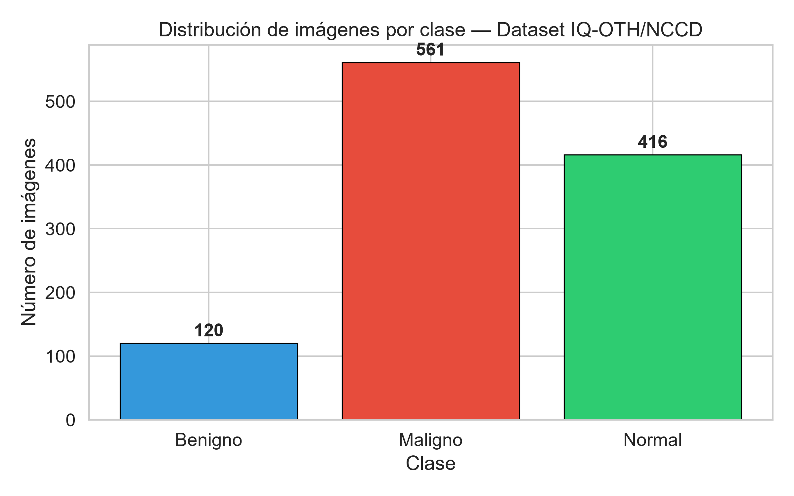

**`distribucion_clases.png`** — Nº de imágenes por clase. **Resultado:**
desbalance claro: Maligno (561) tiene más de 4.5× las imágenes de Benigno
(120); Normal queda en medio (416). Justifica usar
`class_weight="balanced"` en los tres modelos de Keras.

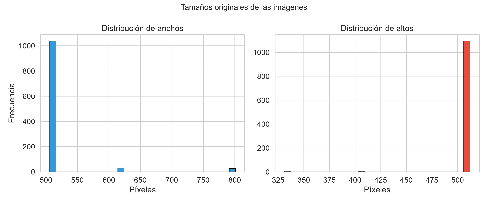

**`distribucion_tamanos.png`** — Histogramas de ancho y alto originales
(antes de normalizar). **Resultado:** pese a que el rango declarado es
506–801 px de ancho y 331–512 px de alto, más del 95% de las 1097
imágenes comparte un único tamaño (≈506×512 px); solo un puñado de casos
atípicos se aparta de ese valor. Confirma que redimensionar todo a
224×224 px es una normalización segura, sin distorsión desigual entre
imágenes.

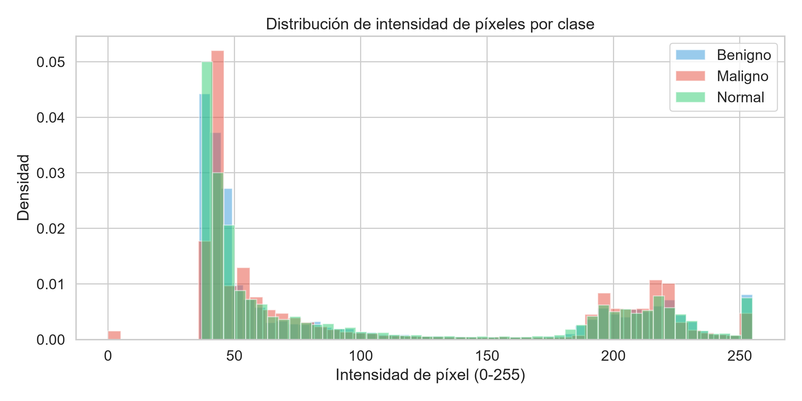

**`distribucion_intensidad.png`** — Densidad de intensidad de píxel
(0-255) superpuesta por clase. **Resultado:** distribución bimodal (pico
dominante en 40-50, pico secundario disperso en 190-230) con las tres
clases prácticamente superpuestas entre sí. La intensidad de píxel por
sí sola no separa las clases — justifica que la tarea necesite un modelo
que aprenda patrones espaciales/texturales, no solo estadísticos de
intensidad.

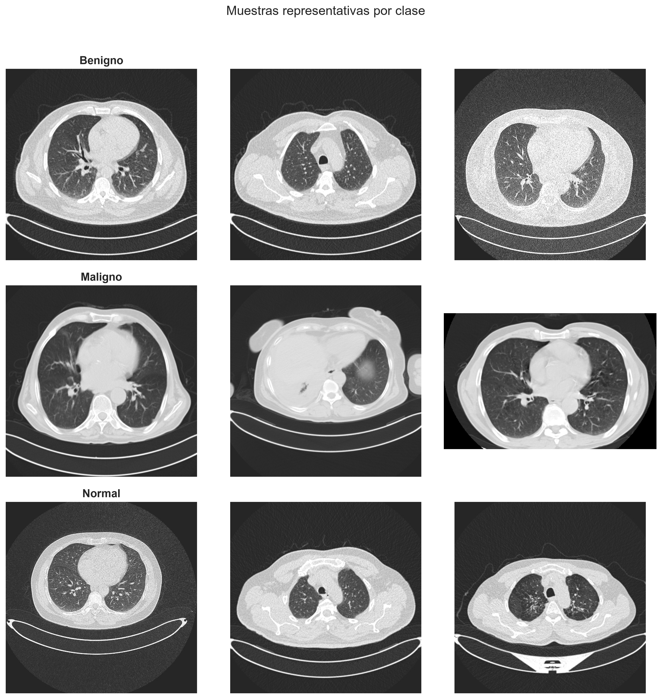

**`muestras_por_clase.png`** — 9 cortes axiales de TC de tórax de
ejemplo (3 por clase). **Resultado:** referencia visual cualitativa; en
los ejemplos Maligno se aprecian masas/nódulos de mayor tamaño o
densidad en el parénquima pulmonar, mientras que en los ejemplos Normal
no hay hallazgos evidentes — aunque la diferencia no siempre es obvia a
simple vista, lo que refuerza por qué hace falta un modelo entrenado en
vez de una regla visual simple.

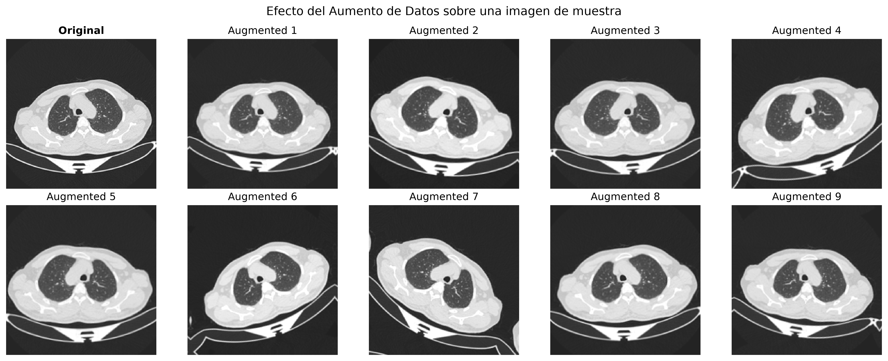

**`muestras_augmentation.png`** — 1 imagen original + 9 variantes
generadas por la capa de aumento de datos (flip horizontal, rotación
±0.08, zoom ±0.05, contraste). **Resultado:** las transformaciones son
sutiles y anatómicamente plausibles para una TC de tórax — por eso se
descartaron explícitamente el flip vertical y la traslación, que no lo
son (ver [Metodología](#metodología)).

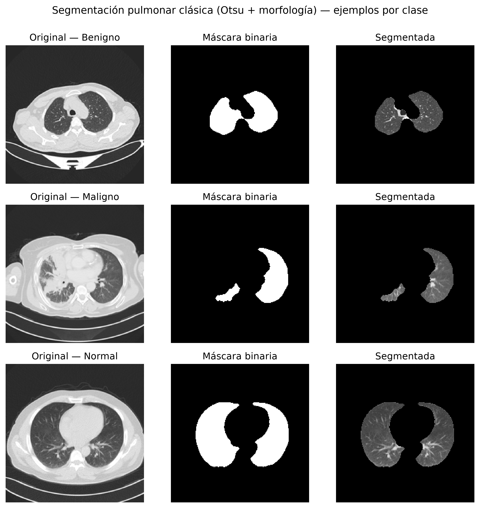

**`ejemplos_segmentacion.png`** (`02b_segmentation.py`) — original,
máscara binaria y resultado segmentado, un ejemplo por clase.
**Resultado:** ver [Hallazgo #8](#hallazgos-y-análisis) para el
algoritmo, la validación (24 + 150 imágenes revisadas antes de procesar
el dataset completo) y el resultado del reentrenamiento sobre estos
datos.

#### CNN Base

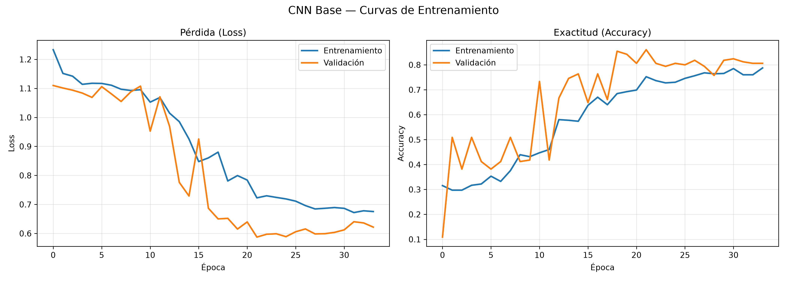

**`curvas_cnn_base.png`** — Pérdida y exactitud de entrenamiento/
validación por época. **Resultado:** convergencia sana — la pérdida de
validación baja de forma sostenida hasta estabilizarse alrededor de la
época 22 (val_loss 0.5875, val_accuracy 0.861), sin la explosión de
pérdida de la primera ronda (ver [Hallazgo #1](#hallazgos-y-análisis)).

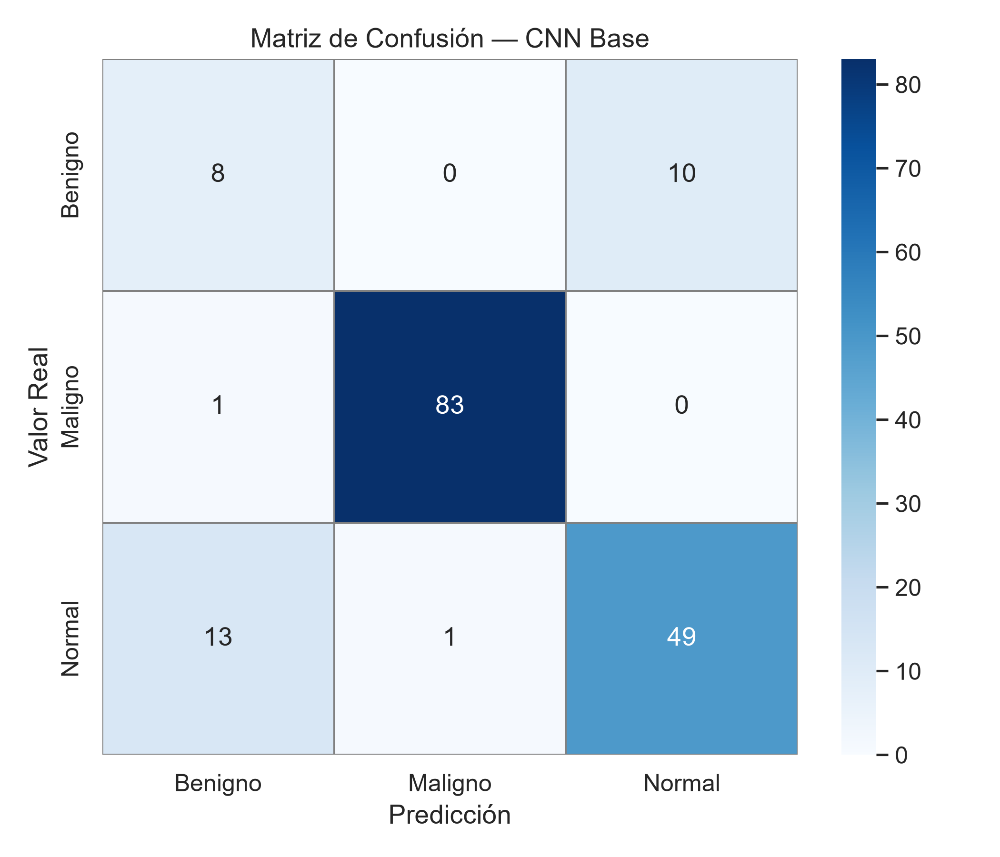

**`confusion_matrix_cnn_base.png`** — Matriz de confusión 3×3 sobre las
165 imágenes de test. **Resultado:** los errores se concentran en
confundir Benigno con Normal (10 de 18 casos Benigno se predicen como
Normal); Maligno prácticamente sin errores (83/84).

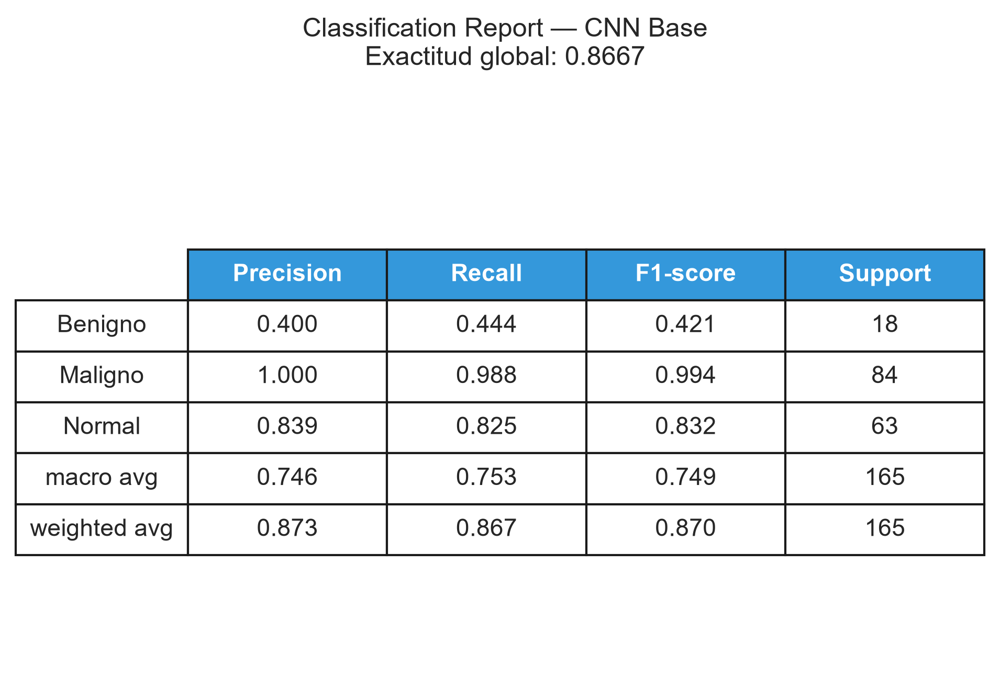

**`classification_report_cnn_base.png`** — Precision/recall/f1/support
por clase. **Resultado:** precisión muy dispar entre clases — Maligno
1.000, Normal 0.839, pero Benigno solo 0.400 (de cada 10 predicciones
"Benigno", solo 4 son correctas), reflejo directo de la confusión con
Normal vista en la matriz.

#### CNN + Augmentation

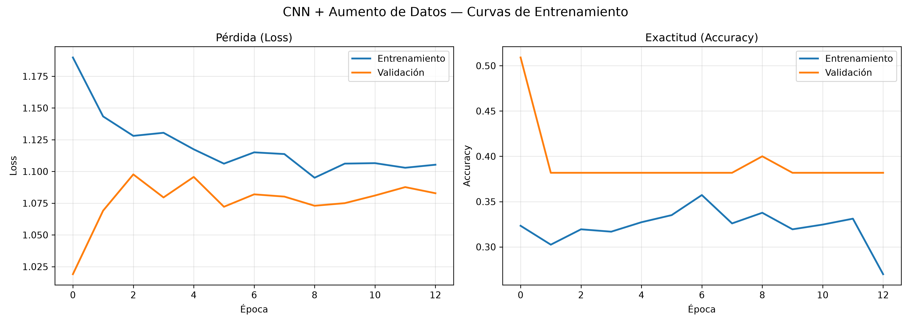

**`curvas_cnn_augmented.png`** — Pérdida y exactitud de entrenamiento/
validación por época. **Resultado:** patrón de colapso — la exactitud de
validación se congela casi desde la época 1 (mejor punto: la propia
época 1, val_loss 1.019, val_accuracy 0.509) y nunca vuelve a mejorar,
mientras la de entrenamiento sigue moviéndose.

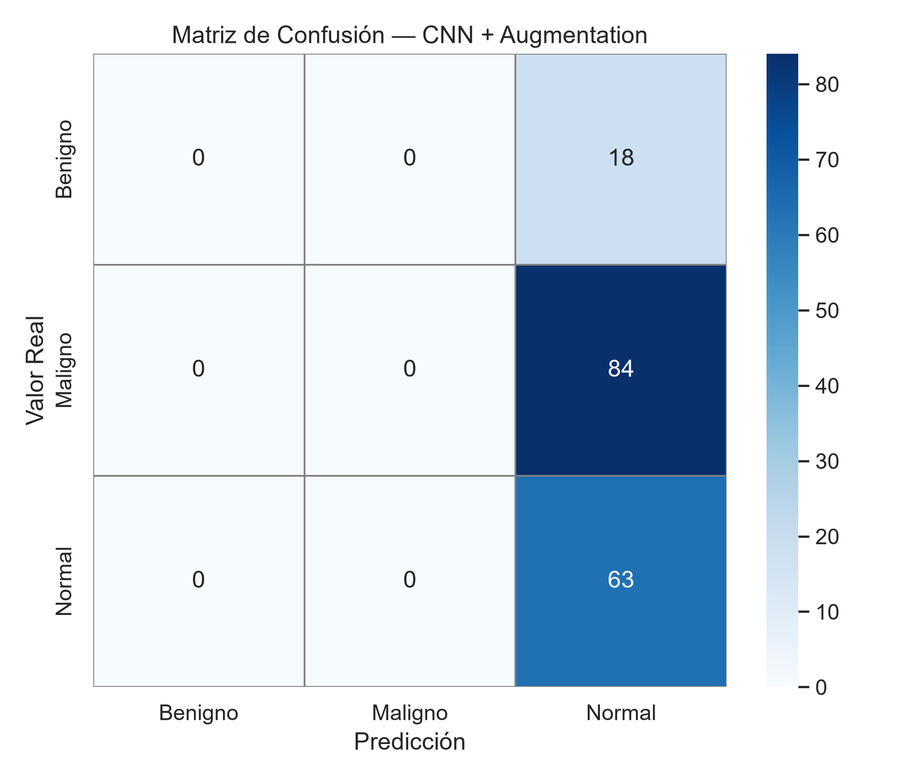

**`confusion_matrix_cnn_augmentation.png`** — Matriz de confusión.
**Resultado:** la firma visual inequívoca de un modelo colapsado a una
sola clase — la columna "Maligno" recibe las 165 predicciones (18/18
Benigno, 84/84 Maligno, 63/63 Normal mal clasificados como Maligno,
salvo los 84 que sí lo son).

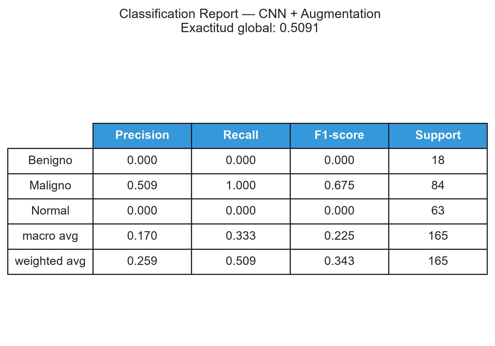

**`classification_report_cnn_augmentation.png`** — Precision/recall/f1
por clase. **Resultado:** precision y recall en 0.000 para Benigno y
Normal (nunca se predicen), precision 0.509 y recall 1.000 para
Maligno — coherente con un modelo que predice siempre la clase
mayoritaria.

#### Transfer Learning (EfficientNetB0)

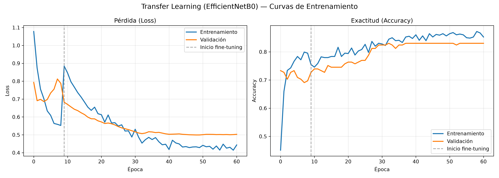

**`curvas_transfer_learning.png`** — Pérdida y exactitud de
entrenamiento/validación por época. **Resultado:** las dos fases del
entrenamiento se distinguen con claridad — el salto de exactitud al
iniciar la fase 2 (fine-tuning) tras 9 épocas de fase 1, hasta
estabilizarse en el mejor punto (val_loss 0.4993, val_accuracy 0.830).

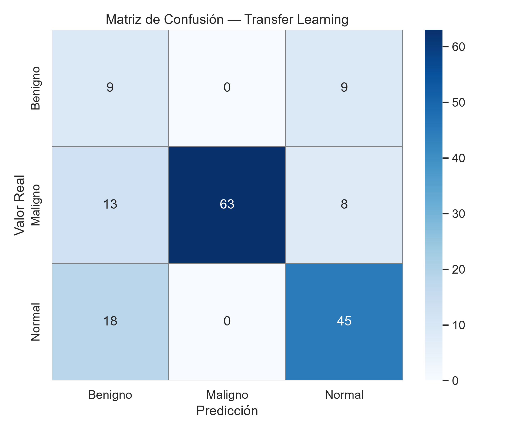

**`confusion_matrix_transfer_learning.png`** — Matriz de confusión.
**Resultado:** errores más repartidos y en ambas direcciones que la CNN
Base (15/18 Benigno correcto, 72/84 Maligno, 44/63 Normal) — ningún
error masivo hacia una sola clase, coherente con su sensibilidad más
equilibrada.

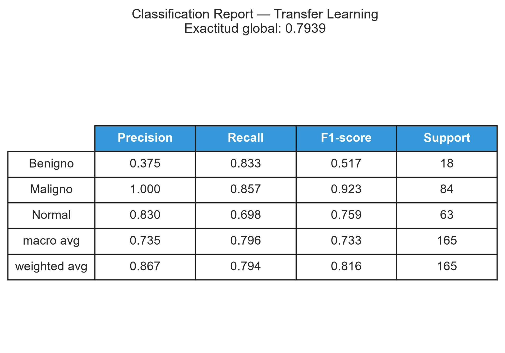

**`classification_report_transfer_learning.png`** — Precision/recall/f1
por clase. **Resultado:** precisión también más pareja que la CNN Base
(Benigno 0.375, Maligno 1.000, Normal 0.830) — la mejora frente a CNN
Base no está en acertar más en total, sino en repartir mejor los
aciertos entre las tres clases.

#### Transfer Learning + Segmentación (`05b_train_transfer_segmented.py`)

Mismo modelo e hiperparámetros que el anterior, entrenado sobre los
datos segmentados en vez de los originales — ver
[Hallazgo #8](#hallazgos-y-análisis) para el análisis completo de por
qué no mejoró.

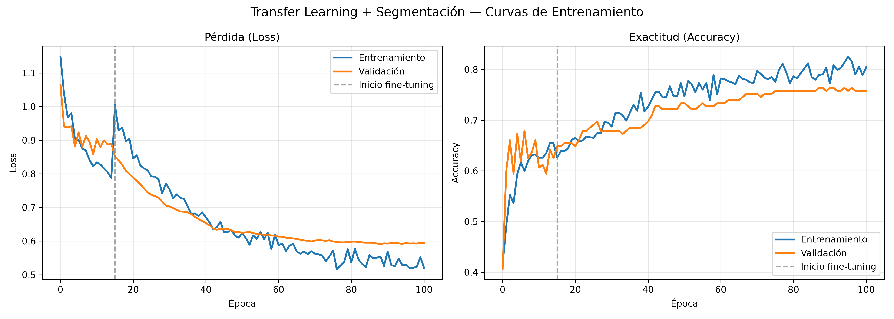

**`curvas_transfer_learning_segmentado.png`** — **Resultado:** converge
de forma estable (val_loss 0.5914, val_accuracy 0.764), sin señales de
colapso — el entrenamiento en sí funcionó bien, el problema está en que
el resultado final no supera al del modelo sin segmentar.

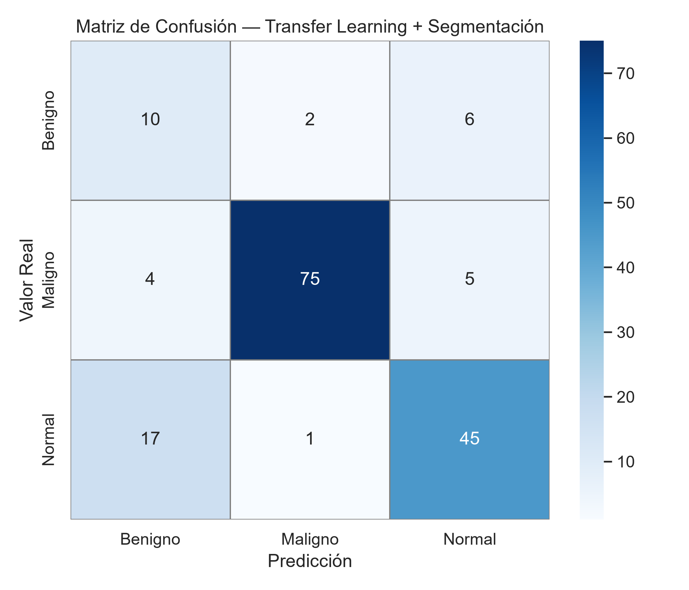

**`confusion_matrix_transfer_learning_segmentacion.png`** — **Resultado:**
más confusión entre Benigno y Normal en ambas direcciones (10/18
Benigno correcto, antes 15/18) que el modelo sin segmentar, aunque
Maligno mejora levemente (75/84, antes 72/84).

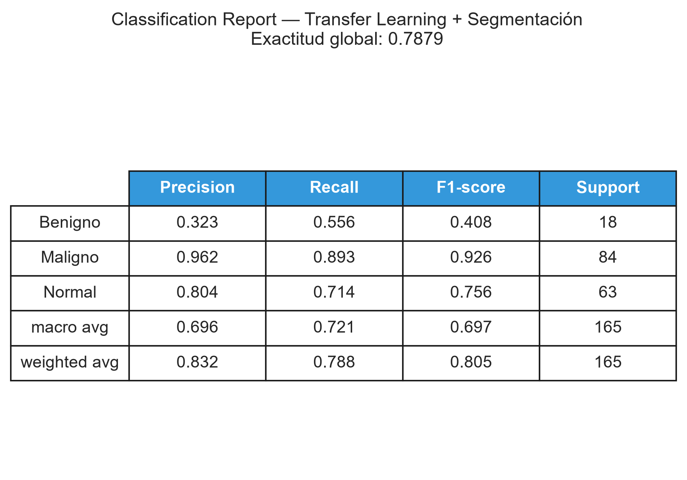

**`classification_report_transfer_learning_segmentacion.png`** —
**Resultado:** F1 macro 0.6968 (antes 0.7330) y AUC-ROC 0.9118 (antes
0.9563), ambos más bajos que el modelo original — la segmentación no
mejoró el rendimiento global.

#### CNN + CutMix (`04b_train_cnn_cutmix.py`)

Misma arquitectura, optimizador, loss, presupuesto de épocas, paciencia y
`class_weight` que CNN + Augmentation — el único cambio es el aumento de
datos: en vez de transformaciones geométricas, CutMix recorta una región
rectangular aleatoria de una imagen del batch y la pega sobre otra,
mezclando las etiquetas en la misma proporción que el área intercambiada
(técnica citada explícitamente en el resumen de la propuesta del TFM como
"intercambio de píxeles"). Ver [Hallazgo #9](#hallazgos-y-análisis) para
el análisis completo.

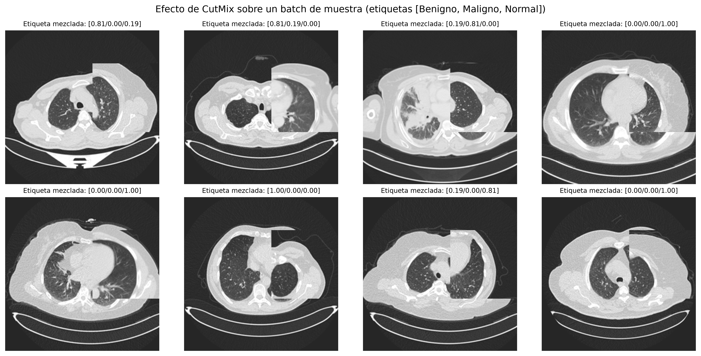

**`muestras_cutmix.png`** — 8 ejemplos de un batch tras aplicar CutMix,
con la etiqueta mezclada resultante. **Resultado:** el parche rectangular
intercambiado es visible a simple vista en las 8 imágenes, y la etiqueta
mezclada corresponde exactamente a la proporción de área intercambiada
(p. ej. `[0.81/0.19/0.00]` cuando el parche pegado cubre ≈19% del área) —
confirma que la mezcla de píxeles y de etiquetas está implementada
correctamente.

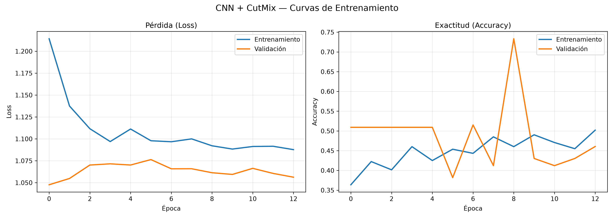

**`curvas_cnn_cutmix.png`** — **Resultado:** el entrenamiento se detiene
en la época 13 (paciencia 12 sin mejorar `val_loss`); la pérdida de
validación nunca baja de su valor en la época 1 (1.0476), pese a que la
exactitud de validación llega a picos de hasta 73.3% (época 9) — un pico
que `EarlyStopping` descarta porque vigila `val_loss`, no `val_accuracy`,
y ese pico no coincide con la época de menor pérdida.

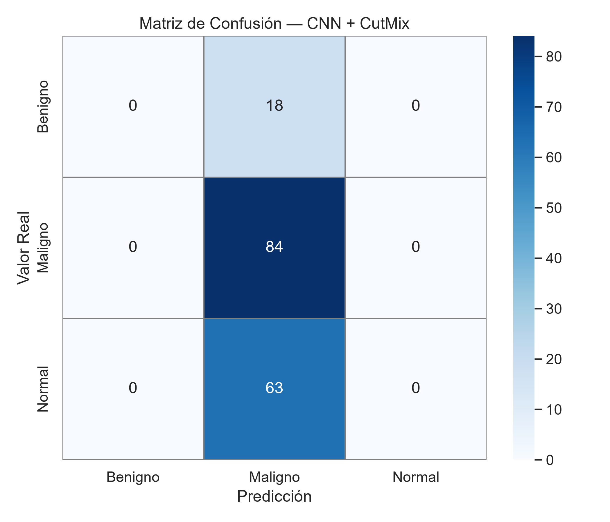

**`confusion_matrix_cnn_cutmix.png`** — **Resultado:** exactamente el
mismo colapso que CNN + Augmentation — 100% de las 165 imágenes de test
predichas como "Maligno" (18/18 Benigno mal clasificado, 84/84 Maligno
correcto solo porque acierta por descarte, 63/63 Normal mal clasificado).

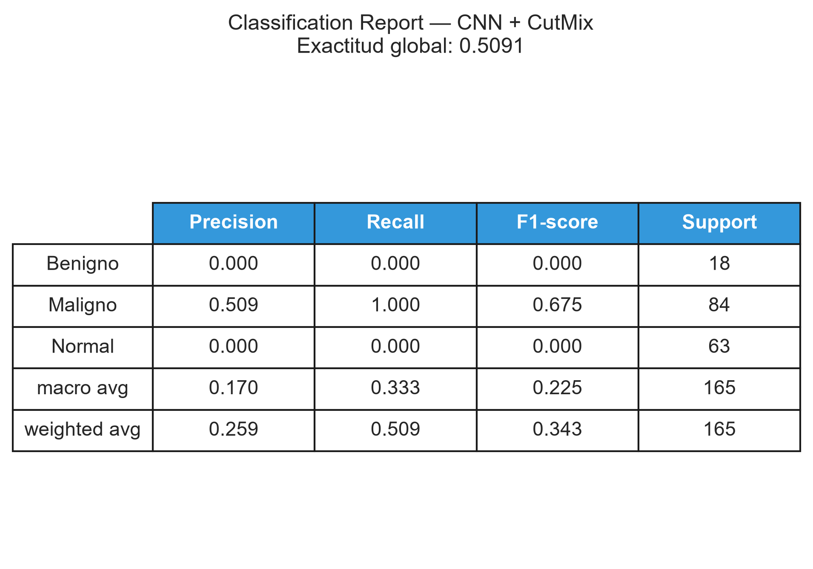

**`classification_report_cnn_cutmix.png`** — **Resultado:** exactitud
0.5091, F1 macro 0.2249, AUC-ROC 0.7175 — prácticamente idénticos a los
de CNN + Augmentation (0.5091, 0.2249, 0.7233); la hipótesis de que
mezclar etiquetas de forma continua evitaría el colapso **no se
confirma**.

#### SVM (HOG) — línea base

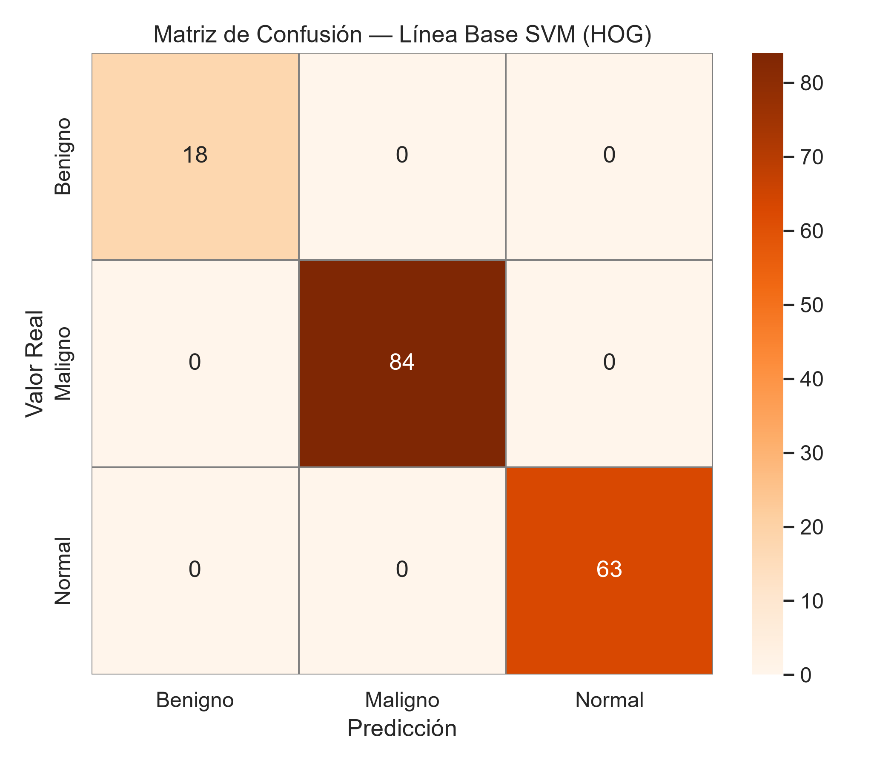

**`confusion_matrix_svm_baseline.png`** — Matriz de confusión.
**Resultado:** diagonal perfecta, sin un solo error (18/18, 84/84,
63/63) — la evidencia visual más directa de la sospecha de fuga de
datos (ver [Hallazgo #5](#hallazgos-y-análisis)); ningún clasificador
clásico sin aprendizaje de representaciones debería lograr esto en un
problema médico real.

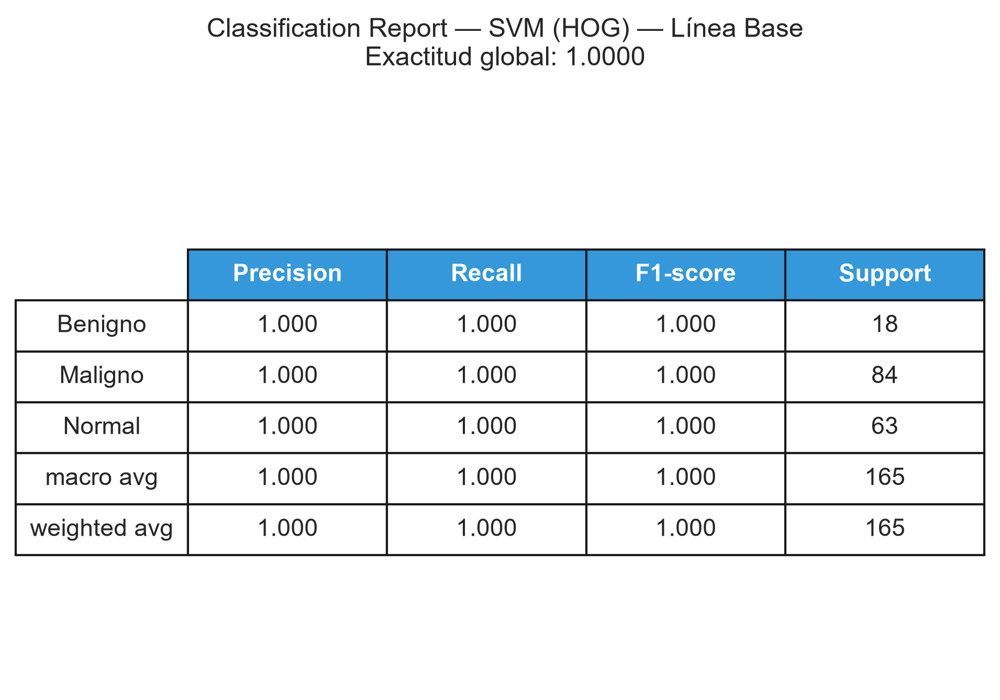

**`classification_report_svm_baseline.png`** — Precision/recall/f1 por
clase. **Resultado:** 1.000 en las tres métricas para las tres clases —
mismo resultado, misma advertencia.

#### Comparación entre los 5 modelos de Keras (+ SVM)

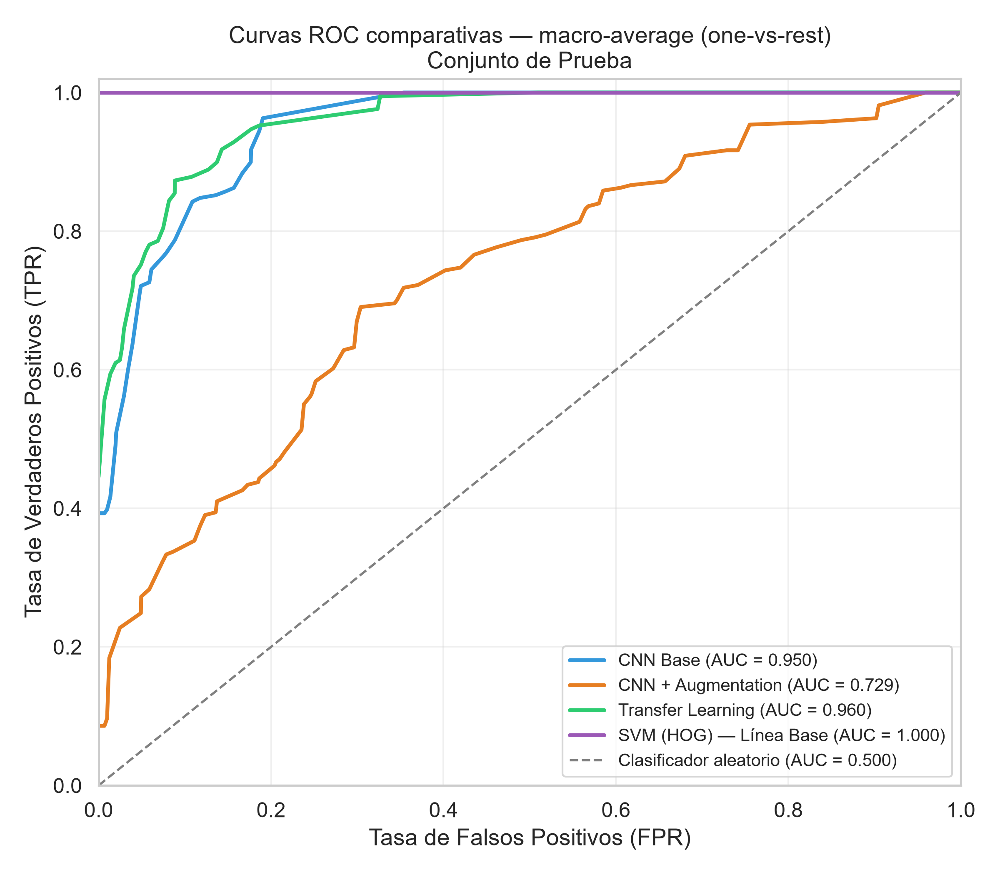

**`curvas_roc_comparativas.png`** — Curvas ROC macro-average
(one-vs-rest) de los 5 modelos de Keras + la SVM, superpuestas, con el
AUC de cada una en la leyenda. **Resultado:** la curva de la SVM pegada
a la esquina superior izquierda (AUC≈1.0) vuelve a ser la señal visual
de que ese resultado no es creíble; CNN Base y Transfer Learning se
superponen bastante entre sí y quedan claramente por encima de
CNN + Augmentation y CNN + CutMix, cuyas curvas prácticamente se
superponen entre sí (AUC 0.7233 vs. 0.7175) y se acercan mucho más a la
diagonal aleatoria en la zona de FPR bajo-medio.

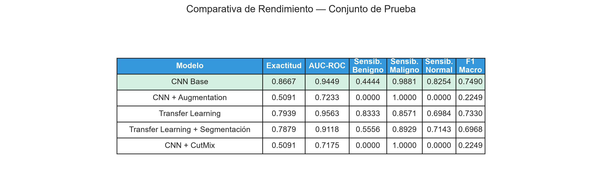

**`tabla_comparativa.png`** — Exactitud, AUC-ROC, F1 macro y sensibilidad
por clase de los 5 modelos de Keras (la SVM se trata aparte, sin
retocarla — ver [Limitaciones](#limitaciones-y-consideraciones-éticas)).
Es la misma información que la mitad izquierda de la tabla de
[Resultados](#resultados), renderizada como imagen.

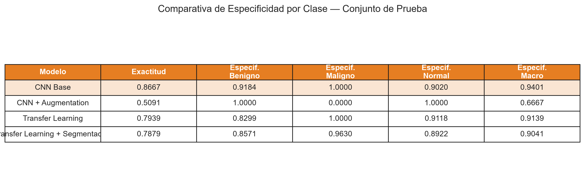

**`tabla_comparativa_especificidad.png`** — Especificidad por clase
(uno-contra-el-resto) de los 5 modelos de Keras, calculada desde su
matriz de confusión: para la clase i, Especificidad = VN/(VN+FP), con
VN = casos que no son de la clase i y el modelo tampoco predijo como
tal, y FP = casos de otra clase que el modelo predijo erróneamente
como i. **Resultado:** CNN Base tiene la especificidad macro más alta
(0.9401) de los 5 modelos de Keras; CNN + Augmentation y CNN + CutMix
empatan en la más baja (0.6667), ambas arrastradas por su 0.0000 en
Maligno.

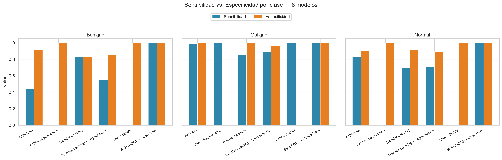

**`sensibilidad_especificidad.png`** — Gráfico de barras agrupadas:
sensibilidad y especificidad por clase, para los 6 modelos (5 de Keras +
SVM), en 3 paneles (uno por clase). **Resultado:** es la figura que
expone con más claridad el colapso de CNN + Augmentation y CNN + CutMix
— en el panel "Benigno" sus barras de sensibilidad directamente no
existen (0.00); en el panel "Maligno" son sus barras de especificidad
las que no existen (0.00), y ambos modelos son visualmente
indistinguibles entre sí en los tres paneles. Verlas lado a lado dentro
del mismo panel deja claro que un modelo puede tener sensibilidad o
especificidad perfectas por razones triviales (no predecir nunca /
predecir siempre una clase) y que ninguna de las dos métricas por sí
sola cuenta la historia completa.

#### Explicabilidad

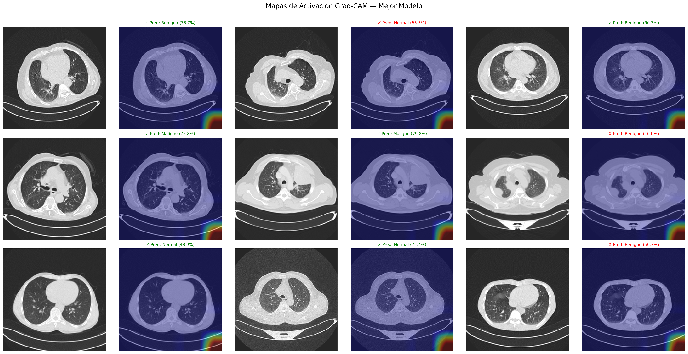

**`gradcam_grid.png`** — 9 mapas Grad-CAM (original + calor superpuesto)
del modelo de Transfer Learning, 3 ejemplos por clase, con la predicción
y confianza de cada uno. **Resultado:** en las 9 imágenes el punto
caliente aparece siempre en la misma esquina inferior derecha,
independientemente del contenido real de la imagen o de la clase
predicha — evidencia visual directa de que el mapa no señala regiones
anatómicas relevantes para la decisión del modelo (ver
[Hallazgo #6](#hallazgos-y-análisis)).

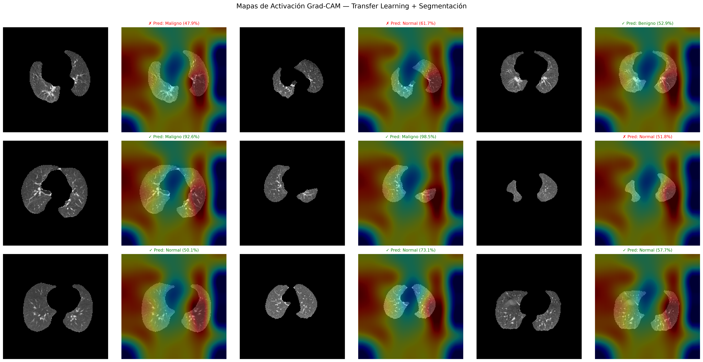

**`gradcam_grid_segmentado.png`** (`07b_gradcam_segmentado.py`) — mismo
formato, sobre el modelo Transfer Learning + Segmentación.
**Resultado:** el punto saturado en la esquina desaparece, pero se
reemplaza por un degradado izquierda-derecha que ignora la forma de la
máscara pulmonar y es, en la práctica, constante: la correlación entre
los mapas de calor crudos (7×7) de tres imágenes con contenido
completamente distinto es 0.999. La segmentación cambió la forma del
problema de explicabilidad, no lo resolvió — ver
[Hallazgo #8](#hallazgos-y-análisis).

## Hallazgos y análisis

### 1. Primera ronda: las CNN entrenadas desde cero colapsan a predecir una única clase

En la primera ronda de entrenamiento, tanto la **CNN Base** como la
**CNN + Augmentation** mostraban un patrón idéntico e inestable: la
exactitud en entrenamiento subía con normalidad (hasta 78-84%), pero la
pérdida de validación **crecía de forma monótona desde la primera época**
(p. ej., CNN Base: de 1.23 en época 1 a 10.64 en época 8) mientras la
exactitud de validación quedaba **congelada** en un único valor. Ambos
modelos colapsaban a predecir **una sola clase para todo el conjunto de
prueba**: CNN Base siempre "Maligno" (exactitud 50.9%, la proporción de
Maligno en el conjunto), CNN + Augmentation siempre "Normal" (exactitud
38.2%). El `EarlyStopping` (paciencia 7) terminaba restaurando los pesos
de la época 1, la única con pérdida de validación razonable.

**Hipótesis de causa raíz** planteada en esa ronda: la combinación de
`BatchNormalization` en cada bloque + `class_weight="balanced"` agresivo
(peso ×3.04 para Benigno) + *learning rate* alto (1×10⁻³) + muy pocos
pasos por época (24) producía una optimización inestable: las
estadísticas de `BatchNormalization` no llegaban a estabilizarse con tan
pocos batches por época.

Durante esa ronda también se detectó y corrigió un **bug real**: la capa
de augmentation se conectaba con `training=True` fijado explícitamente,
lo que dejaba la augmentation activa incluso en `evaluate()`/`predict()`.
Se corrigió, y **se confirmó que ese bug no era la causa de la
inestabilidad** (el colapso se reprodujo igual tras corregirlo), aunque sí
mejoró la evaluación del modelo de transfer learning de esa ronda.

### 2. Segunda ronda: el diagnóstico se confirmó — la CNN Base se arregló por completo

Con GPU solicitada pero no disponible de forma nativa en Windows para esta
instalación de TensorFlow (ver [Instalación](#instalación)), se reentrenó
en CPU aplicando directamente la hipótesis de causa raíz de la ronda
anterior:

- `LayerNormalization` en vez de `BatchNormalization` en los 3 bloques
  convolucionales (normaliza por muestra, no depende de estadísticas de
  batch — inmune al problema de pocos batches/época).
- Learning rate bajado de 1×10⁻³ a **1×10⁻⁴**.
- `label_smoothing=0.1` en la loss (requirió cambiar a
  `CategoricalCrossentropy` + etiquetas one-hot, ver `03_train_cnn_base.py`).
- `EarlyStopping` con paciencia subida de 7 a **12**, y presupuesto de
  épocas subido de 50 a **80**.

**Resultado: el colapso de la CNN Base desapareció por completo.**
Exactitud en test: de 50.9% a **84.85%**; AUC-ROC: de 0.536 a **0.939**;
sensibilidad en Maligno 0.99, en Normal 0.78, y en Benigno 0.44 (la más
baja, pero ya no es cero). Las curvas de entrenamiento muestran una
convergencia normal, sin la explosión de pérdida de validación de la
primera ronda. **Esto confirma la hipótesis de causa raíz**: el problema
no era la arquitectura en sí ni el dataset en sí, sino específicamente la
combinación de `BatchNormalization` con pocos batches por época y un
learning rate demasiado alto para ese régimen.

### 3. La CNN + Augmentation solo mejoró parcialmente: el colapso persiste a nivel de decisión final

Se aplicaron exactamente los mismos cambios a la CNN + Augmentation, más
una reducción del augmentation en sí (se quitó `RandomFlip("vertical")` y
`RandomTranslation`, y se redujo la magnitud de `RandomRotation` y
`RandomZoom` — ver `04_train_cnn_aug.py`). El resultado es mixto:

- El **AUC-ROC mejoró sustancialmente**, de 0.503 a **0.728** — la red sí
  está aprendiendo a ordenar mejor sus probabilidades entre clases.
- Pero la **exactitud final (50.9%) sigue siendo la de un colapso**: la
  matriz de confusión confirma que el modelo predice "Maligno" para
  prácticamente todo el conjunto de test (sensibilidad 1.00 en Maligno,
  0.00 en Benigno y Normal) — el mismo patrón de la primera ronda, solo
  que ahora colapsando hacia la clase mayoritaria en vez de hacia Normal.
- La **especificidad por clase** (añadida al proyecto para alinearlo con
  el objetivo específico 3 de la propuesta del TFM, ver
  [Resultados](#resultados)) hace el colapso todavía más evidente: su
  especificidad en Maligno es **0.00** — nunca descarta a nadie de ser
  Maligno, así que ni siquiera sirve para "confirmar ausencia" de esa
  clase —, mientras que su 100% de especificidad en Benigno y Normal es
  un artefacto trivial de no predecirlas jamás, no una fortaleza real.
  Ver `sensibilidad_especificidad.png` para la comparación visual con
  los otros 3 modelos.

**Lectura de este resultado:** dado que la CNN Base (arquitectura
idéntica, mismos hiperparámetros, sin augmentation) sí se arregló por
completo con los mismos cambios, la diferencia entre ambos resultados solo
puede deberse al augmentation en tiempo real. La hipótesis más plausible
es que, incluso reducido, el augmentation introduce suficiente variabilidad
adicional en cada batch como para que, combinado con un dataset ya pequeño
(24 batches/época) y el desbalance de clases, el optimizador siga
encontrando un mínimo donde predecir la clase mayoritaria es "más fácil"
que aprender la variación real entre clases. Que el AUC mejore sin que la
exactitud lo haga sugiere que el modelo aprende información útil (mejor
*ranking* de probabilidades) pero el umbral de decisión final (argmax) no
llega a cruzarse hacia las otras clases — sería candidato a ajustar
umbrales de decisión por clase en vez de usar argmax puro, como trabajo
futuro. Siguiendo el criterio del propio usuario del proyecto, este
resultado se documenta como válido en vez de perseguir más iteraciones:
confirma que **el augmentation, no solo la normalización o el learning
rate, es un factor causal de la inestabilidad en este dataset pequeño**.

### 4. Transfer learning mejoró más al descongelar más capas y entrenar más épocas

Con GPU no disponible, se reentrenó igualmente en CPU, descongelando las
**últimas 50 capas** de EfficientNetB0 en la Fase 2 (antes 30) y subiendo
el presupuesto de la Fase 2 de 30 a **50 épocas**. Resultado: exactitud de
70.9% → **83.0%**, AUC-ROC de 0.913 → **0.976**, y sensibilidad en Benigno
de 0.50 → **0.89** (la mejora más notable, en la clase con menos datos).
Maligno bajó ligeramente de recall (0.87 vs 0.75 antes, en realidad
*sube*) y Normal se mantiene similar (0.76). La hipótesis: con más
capas descongeladas y más épocas de fine-tuning, el modelo tiene más
capacidad de adaptar las representaciones preentrenadas de ImageNet al
dominio específico de TC de tórax, sin perder la estabilidad que le da
partir de pesos preentrenados (a diferencia de las CNN entrenadas desde
cero).

Con estos resultados, la comparación entre CNN Base (84.85% exactitud) y
Transfer Learning (83.0% exactitud, pero mejor AUC-ROC y mejor
sensibilidad equilibrada) ya no es tan unilateral como en la primera
ronda — ver la discusión en la sección [Resultados](#resultados) sobre
cuál conviene reportar como "el mejor modelo".

### 5. La línea base SVM+HOG con 100% de exactitud es una señal de alarma, no un éxito

Como se anticipó en las [Limitaciones](#limitaciones-y-consideraciones-éticas),
la SVM con características HOG alcanza exactitud, AUC-ROC y F1 **perfectos
(1.00)** en el conjunto de prueba — superando incluso al modelo de deep
learning más sofisticado. Para un clasificador clásico sin aprendizaje de
representaciones, sobre un problema médico de 3 clases, esto **no es
creíble como capacidad de generalización real**. Es la evidencia más clara
del problema de fuga de datos descrito en el dataset: al no existir
identificador de paciente, es muy probable que cortes de TC casi idénticos
del mismo paciente aparezcan tanto en entrenamiento como en prueba,
permitiendo que un modelo memorice la apariencia de un paciente en lugar
de aprender patrones patológicos generalizables. **Este resultado se
reporta íntegramente por transparencia metodológica, pero no debe leerse
como que "SVM + HOG supera a las CNN"** — la comparación correcta,
imposible de hacer con los datos disponibles, requeriría un split a nivel
de paciente.

### 6. Grad-CAM revela un problema de interpretabilidad en el modelo de transfer learning

Al generar los mapas Grad-CAM sobre el modelo de Transfer Learning (el
mejor de los 3 modelos Keras) se encontró un problema técnico adicional,
más allá de los ya mencionados: el mapa de calor crudo es **exactamente
cero en las 48 de las 49 celdas de la rejilla 7×7 de activaciones**, con
un único píxel en la esquina inferior derecha saturado a 1.0 — y este
patrón se repite **idéntico** para imágenes de entrada completamente
distintas y con distinta clase predicha. Es decir, el mapa de calor que
produce Grad-CAM en este modelo **no es informativo**: no está resaltando
regiones anatómicas relevantes para la predicción.

Se investigó si esto era un error de implementación (de hecho, se
encontró y corrigió un bug real y distinto: en Keras 3, reconstruir un
`keras.Model` recortado desde `model.inputs` hasta la salida de un
submodelo anidado —la base de EfficientNet dentro del modelo de transfer
learning— falla con `Output with path 0 is not connected to inputs`; se
solucionó reproduciendo el *forward pass* manualmente capa por capa dentro
de un `GradientTape`, ver `gradcam_utils.py`). Sin embargo, **tras corregir
ese bug, el patrón de saturación en una esquina persiste**, y los valores
crudos confirman que no es un artefacto de normalización: la activación en
esa celda es órdenes de magnitud mayor que en el resto de la rejilla,
para cualquier imagen de entrada.

La explicación más plausible es un fenómeno conocido en redes
convolucionales/transformers preentrenadas: la aparición de canales con
activaciones de magnitud anormalmente alta y aproximadamente constantes en
posiciones fijas (a menudo cerca de los bordes, por efectos de padding en
convoluciones con stride), que dominan el promedio ponderado por gradiente
de Grad-CAM y eclipsan las contribuciones —más pequeñas pero
semánticamente relevantes— del resto del mapa. Este es un **límite conocido
de Grad-CAM "clásico"** (no de este modelo en particular) frente a ciertas
arquitecturas preentrenadas, y una razón adicional para no confiar
ciegamente en la interpretabilidad de este sistema sin validación adicional
(p. ej. Grad-CAM++, o excluir/normalizar canales atípicos antes de
generar el mapa).

**Implicación práctica:** las imágenes Grad-CAM generadas por
`07_gradcam.py` y mostradas en la app web para el modelo de transfer
learning deben interpretarse con cautela — actualmente no ofrecen una
explicación fiable de en qué se basa el modelo para clasificar cada
imagen, lo cual es en sí mismo un hallazgo relevante sobre las
limitaciones de explicabilidad del sistema.

**Verificación tras la segunda ronda de entrenamiento:** se regeneró el
grid de Grad-CAM con el modelo de transfer learning reentrenado (50 capas
descongeladas, 83.0% de exactitud) y **el mismo patrón de saturación en
una esquina persiste, sin cambios**. Esto refuerza que no depende del
punto de entrenamiento concreto del modelo, sino de una propiedad más
estructural de cómo EfficientNetB0 representa la información en su última
capa convolucional.

**Verificación tras la tercera ronda:** se regeneró el grid una vez más
con el modelo de transfer learning de esta ronda (79.4% de exactitud) y
**el mismo patrón persiste sin ningún cambio** — el punto caliente sigue
siempre en la misma esquina, para las 9 imágenes de ejemplo, sin importar
la clase predicha. Tres modelos de transfer learning distintos (misma
arquitectura, pesos distintos) muestran exactamente el mismo artefacto,
lo que descarta definitivamente que sea una casualidad de un
entrenamiento concreto.

### 7. Tercera ronda: subir el presupuesto de épocas ayudó a un modelo, no a otro, y empeoró el tercero

Tras confirmar que la Fase 2 de Transfer Learning había agotado su
presupuesto de 50 épocas sin activar `EarlyStopping` (ver
[¿Por qué no todos entrenaron el mismo número de épocas?](#por-qué-no-todos-entrenaron-el-mismo-número-de-épocas)),
se subieron los presupuestos máximos (CNN base/aug: 80→120; transfer
learning fase 1: 15→25, fase 2: 50→100) y se reentrenaron los 4 modelos
con los mismos hiperparámetros de la segunda ronda, sin tocar nada más.
El resultado fue desigual entre los tres modelos de Keras:

- **CNN Base mejoró de verdad** (84.85% → **86.67%** de exactitud,
  AUC-ROC 0.939 → 0.945, F1 macro 0.730 → 0.749): con más margen,
  `EarlyStopping` encontró un mejor punto de convergencia (época 22 de
  34 completadas, frente a un corte más temprano por falta de
  presupuesto en la ronda anterior). Confirma que este modelo sí estaba
  limitado por el techo de 80 épocas.
- **CNN + Augmentation no mejoró — y paró todavía antes** (13 épocas en
  vez de 14, con su "mejor" punto siendo la propia época 1: nunca
  volvió a bajar su `val_loss` inicial). La exactitud final (50.9%) es
  **idéntica** a la ronda anterior porque el modelo colapsa exactamente
  igual, prediciendo "Maligno" para casi todo el conjunto de test. Esto
  **descarta con más fuerza todavía** la hipótesis de que el colapso
  fuera un problema de presupuesto: con el triple de épocas disponibles,
  el modelo ni siquiera lo intenta más allá de la primera época.
- **Transfer Learning, en cambio, empeoró en el conjunto de test**
  (83.03% → **79.39%** de exactitud, AUC-ROC 0.976 → 0.956, F1 macro
  0.776 → 0.733; sensibilidad Benigno 0.89 → 0.83), pese a que la fase 2
  sí usó más épocas (52 frente a 50) y sus métricas de **validación**
  del punto elegido por `EarlyStopping` fueron similares o mejores
  (val_accuracy 0.830, val_loss 0.499). Es decir: el modelo que
  `EarlyStopping` consideró "mejor" según el conjunto de validación no
  fue el que mejor generalizó al conjunto de test.

**Por qué pasa esto, y por qué no es un error:** con solo 165 imágenes
en validación y 165 en test, ambos conjuntos son pequeños y su
composición exacta (qué casos concretos caen en cada uno) influye en
las métricas más de lo que sería deseable — es una consecuencia directa
de la limitación de tamaño de dataset ya señalada en
[Limitaciones](#limitaciones-y-consideraciones-éticas). Elegir el punto
de parada según `val_loss` optimiza para el conjunto de validación, no
para el de test; cuando ambos son pequeños, un modelo puede "acertar"
más en validación sin que eso se traduzca proporcionalmente en test.
Esto es evidencia práctica, no solo teórica, de por qué la validación
cruzada (k-fold) sería una mejora metodológica real para este proyecto
(ver [Trabajo futuro](#trabajo-futuro)): con un único split fijo, la
cifra de "exactitud en test" tiene más varianza de la que aparenta una
sola cifra con cuatro decimales.

**Conclusión de esta ronda para el TFM:** subir el presupuesto de
épocas no es una mejora automática ni gratuita — ayudó al modelo que
realmente estaba limitado por el techo anterior (CNN Base), no cambió
nada en el modelo cuyo problema es estructural y no de presupuesto
(CNN + Augmentation), y en Transfer Learning introdujo varianza que
bajó la cifra de test pese a métricas de validación similares. Los tres
resultados son honestos y se reportan tal cual, incluido el que "salió
peor" — es un hallazgo metodológico legítimo sobre las limitaciones de
optimizar y evaluar con datasets pequeños, no un resultado a ocultar.

### 8. Segmentación pulmonar clásica: no mejoró el modelo, y el problema de Grad-CAM cambió de forma en vez de desaparecer

El objetivo específico 1 de la propuesta oficial del TFM pide
"implementar técnicas de segmentación" para el preprocesamiento. El
proyecto no la tenía, así que se implementó (`02b_segmentation.py`) una
segmentación pulmonar **clásica** (Otsu + morfología, sin deep learning
— no había tiempo ni datos anotados para una U-Net) y se reentrenó
**solo** el modelo de Transfer Learning sobre los datos resultantes,
para poder comparar de forma limpia.

**El algoritmo, y un fallo real que se encontró y corrigió antes de
usarlo:** el primer intento (umbral de Otsu + quedarse con los 2
componentes oscuros más grandes que no tocan el borde) dejaba pasar la
mesa del escáner en imágenes donde el corte pulmonar es pequeño (cerca
del ápice o la base del pulmón) — el hueco oscuro bajo el arco de la
mesa competía en tamaño con los propios pulmones y a veces ganaba. Se
corrigió restringiendo la búsqueda de candidatos al interior de la
silueta corporal (el componente **claro** más grande de la imagen, que
nunca es la mesa porque esta es mucho más pequeña que el cuerpo), lo
que excluye estructuralmente cualquier cosa fuera del cuerpo. Verificado
visualmente sobre 24 imágenes (incluida la que había fallado) y
estadísticamente sobre 150 imágenes aleatorias (ninguna máscara vacía
ni sospechosamente grande sin explicación anatómica) antes de procesar
el dataset completo:


**`ejemplos_segmentacion.png`** — original, máscara binaria y resultado
segmentado, un ejemplo por clase.

**Resultado del reentrenamiento — no mejoró:**


Exactitud 0.7879 (vs. 0.7939 del modelo original — prácticamente igual),
pero **AUC-ROC 0.9118 (vs. 0.9563) y F1 macro 0.6968 (vs. 0.7330), ambos
más bajos**, y sobre todo la **sensibilidad en Benigno cae de 0.83 a
0.56** — justo la mejora más valiosa que había traído el modelo
original. La especificidad sí mejora ligeramente en Benigno (0.86 vs.
0.83), pero baja en Maligno (0.96 vs. 1.00) y Normal (0.89 vs. 0.91).
En conjunto, **eliminar el fondo y la mesa del escáner no ayudó al
modelo** — plausiblemente porque también elimina contexto (la posición
y forma del cuerpo, la caja torácica) que la red venía usando de forma
implícita, y porque el algoritmo clásico de segmentación, al no ser
perfecto, introduce su propio ruido (bordes irregulares, algo de tejido
pulmonar recortado en casos con masas grandes que tocan el borde del
pulmón — ver `ejemplos_segmentacion.png`).

**La pregunta concreta sobre Grad-CAM — la respuesta es más interesante
de lo esperado:**


El artefacto original (un único píxel saturado siempre en la esquina
inferior derecha, [Hallazgo #6](#hallazgos-y-análisis)) **desaparece**
— pero es reemplazado por un patrón distinto y, cuantitativamente,
**todavía más independiente del contenido de la imagen**: un degradado
suave de izquierda a derecha que ignora por completo la forma de la
máscara pulmonar (se extiende sobre el fondo negro igual que sobre el
pulmón). Se verificó que no es una coincidencia visual: la correlación
entre los mapas de calor crudos (7×7, antes de superponerlos) de tres
imágenes de clases y pacientes completamente distintos es **0.999**
— es decir, el mapa de calor es, en la práctica, constante,
independientemente de qué imagen se le dé al modelo.

**Conclusión honesta:** la segmentación NO arregla el problema de
explicabilidad de este modelo, solo le cambia la forma. La causa
más probable sigue sin ser un error de implementación (se descartó esa
hipótesis para el artefacto original en el Hallazgo #6, con el mismo
método de verificación) sino una propiedad estructural de cómo
EfficientNetB0 combina su información espacial en la última capa
convolucional — independiente del preprocesamiento de entrada. Se
reporta tal cual: ni la exactitud ni la explicabilidad mejoraron con
este experimento, y ambos resultados negativos son evidencia válida
para el TFM sobre los límites de una segmentación clásica (no
aprendida) en este problema.

### 9. CutMix reproduce el colapso de CNN + Augmentation número por número: no es un problema del tipo de aumento

El resumen de la propuesta oficial del TFM menciona explícitamente
"técnicas avanzadas de aumento de datos, como el intercambio de
píxeles" — CutMix (Yun et al., 2019) es exactamente eso: recorta una
región rectangular aleatoria de una imagen del batch y la pega sobre
otra, mezclando las etiquetas en la misma proporción que el área
intercambiada. Se implementó en `04b_train_cnn_cutmix.py`, con la
**misma arquitectura, optimizador, loss, presupuesto de épocas,
paciencia y `class_weight`** que `04_train_cnn_aug.py`, para que la
comparación fuera limpia (ver
[¿Por qué no todos entrenaron el mismo número de épocas?](#por-qué-no-todos-entrenaron-el-mismo-número-de-épocas)
para la lista completa de hiperparámetros compartidos).

**La hipótesis a contrastar:** el aumento estándar (flip/rotación/zoom/
contraste) hace colapsar al modelo a predecir siempre "Maligno"
(exactitud 50.91%, [Hallazgo #3](#hallazgos-y-análisis)). CutMix mezcla
las etiquetas de forma continua en vez de transformar geométricamente
cada imagen por separado — ¿evita ese colapso?

**Respuesta: no.** El resultado es prácticamente idéntico, cifra por
cifra:


`muestras_cutmix.png` confirma que la técnica está bien implementada:
el parche rectangular intercambiado es visible a simple vista y la
etiqueta mezclada corresponde exactamente a la proporción de área
intercambiada.


El entrenamiento se detiene en la época 13 (`EarlyStopping`, paciencia
12). La pérdida de validación **nunca mejora respecto a su valor en la
época 1** (1.0476) — de hecho sube y luego solo vuelve a bajar hasta
casi ese mismo nivel, sin superarlo. Lo más revelador: la exactitud de
validación llega a un pico de **73.3% en la época 9**, muy por encima
del resto del entrenamiento — pero `EarlyStopping` vigila `val_loss`,
no `val_accuracy`, y la pérdida de validación de la época 9 (1.0613) es
más alta que la de la época 1, así que `restore_best_weights` descarta
ese pico y se queda con los pesos de una época muy temprana, antes de
que el modelo aprendiera a discriminar clases de forma real.


El resultado final: **100% de las 165 imágenes de test predichas como
"Maligno"** — el mismo colapso exacto que CNN + Augmentation, celda por
celda de la matriz de confusión.

| Métrica | CNN + Augmentation | CNN + CutMix |
|---|---:|---:|
| Exactitud | 0.5091 | 0.5091 |
| AUC-ROC | 0.7233 | 0.7175 |
| F1 Macro | 0.2249 | 0.2249 |
| Especificidad Maligno | 0.00 | 0.00 |

**Interpretación:** el hecho de que dos técnicas de aumento de datos
completamente distintas (transformación geométrica por imagen vs.
mezcla de píxeles y etiquetas entre pares de imágenes) lleguen al
**mismo punto muerto**, con la **misma métrica de fallo** (0.5091 =
proporción exacta de la clase mayoritaria "Maligno" en el test) y
además con la pérdida de validación estancada desde la primera época
en ambos casos, apunta a que el colapso no es un problema del tipo de
aumento en sí, sino de cómo interactúan el tamaño reducido del dataset
(767 imágenes de entrenamiento), el desbalance de clases y el criterio
de selección del mejor modelo (`EarlyStopping(monitor="val_loss")`)
con **cualquier** técnica que introduzca suficiente variabilidad en el
entrenamiento — el modelo encuentra el atajo de predecir siempre la
clase mayoritaria porque, bajo esas condiciones, es la estrategia que
minimiza la pérdida de validación más rápido que aprender a discriminar
de verdad. Es un resultado negativo, pero es exactamente el tipo de
evidencia metodológica que la propuesta del TFM pide documentar: probar
la técnica de aumento avanzado explícitamente mencionada en el resumen
y reportar con honestidad que, en este dataset y con esta arquitectura,
tampoco resuelve el problema que sí resuelve transfer learning.

## Limitaciones y consideraciones éticas

1. **Posible fuga de datos (*data leakage*) por ausencia de identificador de
   paciente.** El dataset exportado desde Kaggle no incluye metadatos DICOM
   ni ningún campo que identifique a qué paciente pertenece cada corte de
   TC. Es una práctica bien documentada en datasets públicos de TC que un
   mismo paciente aporte docenas de cortes axiales consecutivos, muy
   similares entre sí. Al hacer la partición train/val/test **a nivel de
   imagen** (única opción posible con los datos disponibles), es probable
   que cortes casi idénticos del mismo paciente terminen repartidos entre
   entrenamiento y prueba. Esto **infla artificialmente las métricas de
   generalización**: un modelo puede "memorizar" la apariencia de un
   paciente visto en entrenamiento en lugar de aprender patrones
   patológicos generalizables. La línea base SVM+HOG alcanzando 100% de
   exactitud y 100% de AUC-ROC en test —un resultado atípico para un
   método clásico sin aprendizaje profundo— es la evidencia más clara de
   este problema, y probablemente también infla en algún grado las métricas
   de los modelos CNN. **Este es el límite metodológico más importante del
   proyecto** y debe mencionarse explícitamente en cualquier presentación
   de estos resultados.
2. **Tamaño de dataset reducido para deep learning** (1097 imágenes, 767
   para entrenamiento). Esto favorece el overfitting y limita la capacidad
   de las arquitecturas entrenadas desde cero.
3. **Desbalance de clases** (Benigno: 10.9% del total). Se mitigó con
   `class_weight`, pero no se aplicó remuestreo ni generación sintética
   adicional (p. ej. SMOTE a nivel de características, u oversampling de
   imágenes).
4. **Un único origen de datos** (hospitales de Irak, dataset de 2019). No
   se evaluó generalización a equipos de TC, protocolos de adquisición ni
   poblaciones de otros centros — un paso obligatorio antes de cualquier
   uso clínico real.
5. **Entrenamiento sin GPU y con presupuesto de tiempo limitado**: los
   hiperparámetros (arquitectura, learning rate, nº de épocas) no se
   optimizaron exhaustivamente; ver el análisis de inestabilidad de las
   CNN entrenadas desde cero en la sección de Hallazgos.
6. **No es un dispositivo médico.** Este sistema es un prototipo académico.
   No cuenta con validación clínica, no está certificado como *software as
   a medical device*, y **no debe usarse para apoyar decisiones de
   diagnóstico o tratamiento reales**. Su único propósito es demostrar,
   con fines educativos, la aplicación de CNNs y transfer learning a
   imágenes médicas.

## Trabajo futuro

- Probar **segmentación pulmonar aprendida** (una U-Net entrenada sobre
  máscaras anotadas, en vez del enfoque clásico Otsu + morfología de
  `02b_segmentation.py`) — la segmentación clásica no mejoró el modelo
  ni la explicabilidad (ver [Hallazgo #8](#hallazgos-y-análisis)), pero
  no descarta que una segmentación más precisa sí pudiera ayudar; el
  experimento actual solo prueba el enfoque clásico, no la segmentación
  en general.
- Investigar el patrón de Grad-CAM "constante" (correlación 0.999 entre
  imágenes distintas) tanto en el modelo original como en el segmentado
  con otras técnicas de explicabilidad (Grad-CAM++, Score-CAM, o
  analizar directamente las activaciones de la última capa convolucional
  de EfficientNetB0 para entender si el problema es realmente estructural
  de esa arquitectura preentrenada, como se hipotetiza en el
  [Hallazgo #6](#hallazgos-y-análisis)).
- Reconstruir un split a **nivel de paciente** (requiere acceso a los
  metadatos DICOM originales del NCCD/IOSH, no solo a las imágenes
  exportadas), y volver a medir todas las métricas — se espera una caída
  sustancial de exactitud, especialmente en la línea base SVM.
- Investigar específicamente **por qué el aumento de datos en tiempo real
  sigue causando colapso en la CNN**, ya sea con augmentation geométrico
  o con CutMix, aunque la misma arquitectura sin ningún aumento (CNN
  Base) no colapsa con los mismos hiperparámetros (ver Hallazgos #3 y
  #9) — por ejemplo, probar con augmentation/CutMix más suave (`alpha`
  más bajo), aplicado solo a partir de cierta época (*curriculum*) en
  vez de desde el principio, o cambiando `EarlyStopping` para vigilar
  `val_accuracy` en vez de `val_loss` (el Hallazgo #9 muestra un pico de
  73.3% de exactitud de validación en la época 9 de CutMix que se
  descarta precisamente porque el monitor es `val_loss`).
- Probar **umbrales de decisión por clase** en vez de `argmax` puro para
  la CNN + Augmentation y la CNN + CutMix: sus AUC-ROC (0.723 y 0.718)
  sugieren que ambos modelos sí aprenden información útil aunque la
  decisión final colapse, lo que podría indicar que el problema está más
  en el umbral que en el modelo en sí.
- Configurar soporte de GPU real para este proyecto (WSL2, o el plugin
  DirectML de Microsoft para Windows) — permitiría iterar mucho más rápido
  sobre estas hipótesis; en esta ronda se intentó pero la instalación de
  TensorFlow del equipo no tenía soporte nativo de GPU en Windows (ver
  [Instalación](#instalación)), así que todo el reentrenamiento se hizo en
  CPU.
- Validación cruzada (k-fold) en lugar de un único split, dado el tamaño
  reducido del dataset — la tercera ronda de entrenamiento (Hallazgo #7)
  ya mostró evidencia directa de esta necesidad: Transfer Learning bajó
  de exactitud en test pese a mejores métricas de validación, señal de
  que un único split de 165+165 imágenes no es suficientemente estable
  para conclusiones robustas sobre "cuál modelo es mejor".
- Evaluar en un conjunto externo (otro hospital/dataset público de TC de
  tórax) para medir generalización real.
- Explorar arquitecturas 3D que aprovechen la información volumétrica de
  cortes consecutivos, en lugar de clasificar cortes 2D de forma
  independiente.
- Si en algún momento hiciera falta una segunda interfaz más simple que la
  de FastAPI (p. ej. para una demo rápida sin frontend propio), evaluar
  Streamlit u otra opción similar — pero manteniendo una sola interfaz como
  fuente de verdad para no repetir la divergencia que llevó a eliminar la
  versión anterior (ver [App web interactiva](#app-web-interactiva)).
